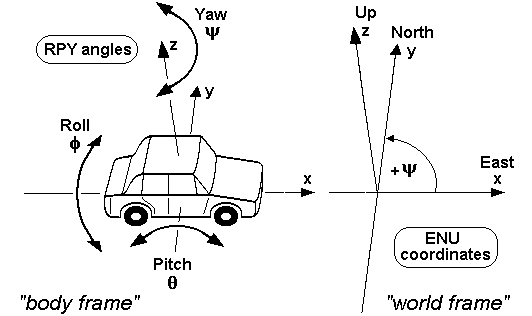
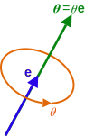
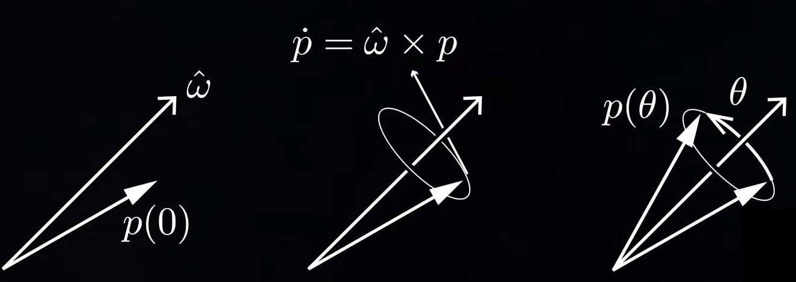
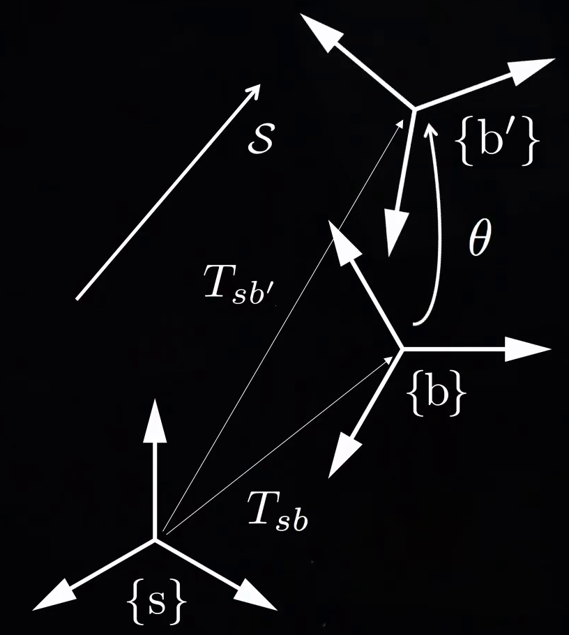
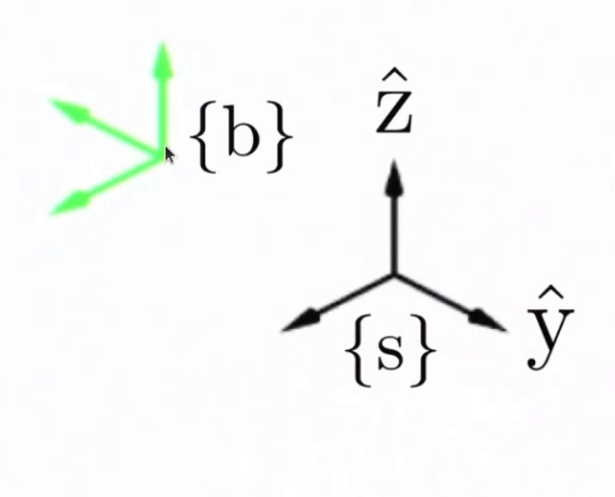
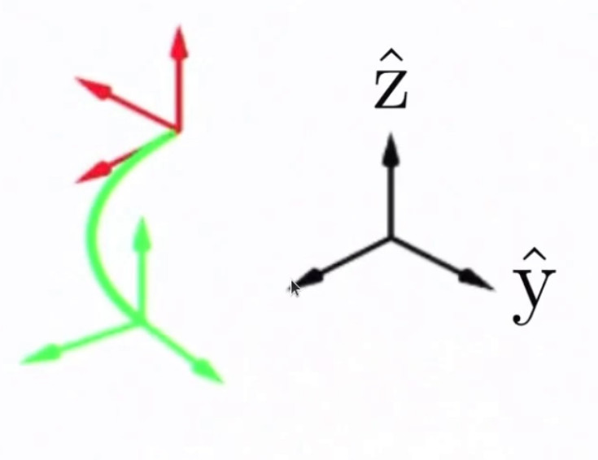
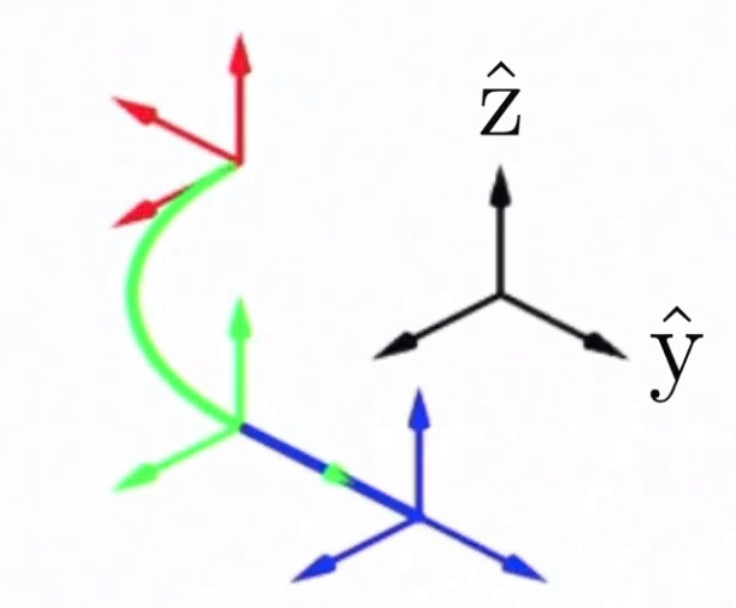
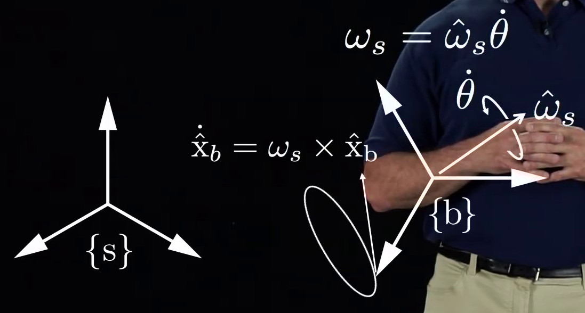
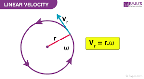
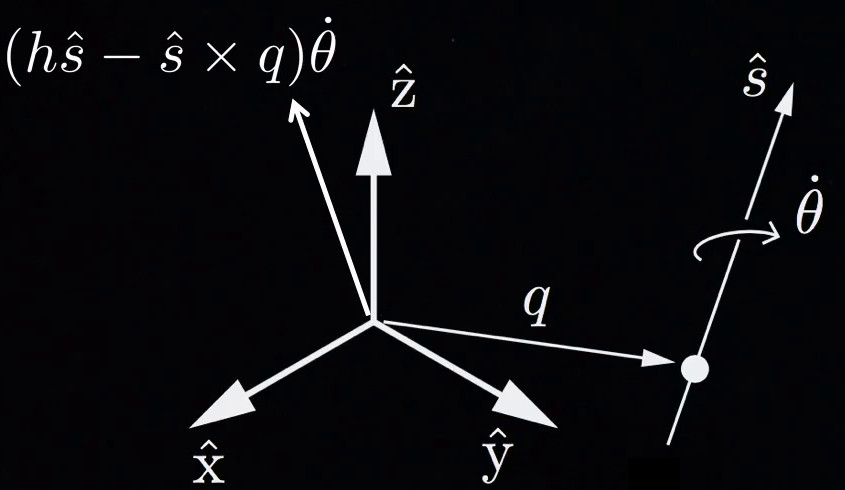

# Chapter 7 Geometry Transformation


# Euler Angles

The Euler angles are three angles to describe the orientation of a rigid body with respect to a fixed coordinate system.


The rotations may about the axes `XYZ` of the original coordinate system, which is assumed to remain motionless (extrinsic), or rotations about the axes of the rotating coordinate system `XYZ` (intrinsic), solidary with the moving body, which changes its orientation with respect to the extrinsic frame after each elemental rotation.

There exist twelve possible sequences of rotation axes, which can be divided into two categories: 
1. **Proper Euler angles**, where one axis of rotation is repeated (x-z-x, x-y-x, y-x-y, y-z-y, z-y-z, z-x-z), 
2. **Tait-Bryan angles**, which rotate around all axes (x-z-y, x-y-z, y-x-z, y-z-x, z-y-x, z-x-y).


Sometimes, both kinds of sequences are called "Euler angles". In that case, the sequences of the first group are called **proper** or **classic Euler** angles.


There are six possibilities of choosing the rotation axes for Tait–Bryan angles. The six possible sequences are:

- x-y′-z″ (intrinsic rotations) or z-y-x (extrinsic rotations)
- y-z′-x″ (intrinsic rotations) or x-z-y (extrinsic rotations)
- z-x′-y″ (intrinsic rotations) or y-x-z (extrinsic rotations)
- x-z′-y″ (intrinsic rotations) or y-z-x (extrinsic rotations)
- z-y′-x″ (intrinsic rotations) or x-y-z (extrinsic rotations): the intrinsic rotations are known as: yaw, pitch and roll
- y-x′-z″ (intrinsic rotations) or z-x-y (extrinsic rotations)


## Roll, Pitch and Yaw

Euler angles are typically denoted as:
-  represents a rotation around the x axis.
-  represents a rotation around the y axis,
-  represents a rotation around the z axis,


<br/>
<br/>


There are several axes conventions in practice for choosing the mobile and fixed axes and these conventions determine the signs of the angles.


Tait–Bryan angles are often used to describe a vehicle's attitude with respect to a chosen reference frame. The positive x-axis in vehicles points always in the direction of movement. For positive y- and z-axis, we have to face two different conventions:

- East, North, Up (ENU), used in geography (z is up and x is in the direction of move, y is pointing left)
- North, East, Down (NED), used specially in aerospace (z is down and x is in the direction of move, y is pointing right)


In case of land vehicles like cars, tanks  ENU-system (East-North-Up) as external reference (World frame), the vehicle's (body's) positive y- or pitch axis always points to its left, and the positive z- or yaw axis always points up.




In case of air and sea vehicles like submarines, ships, airplanes etc., which use the NED-system (North-East-Down) as external reference (World frame), the vehicle's (body's) positive y- or pitch axis always points to its right, and its positive z- or yaw axis always points down. 


# Rotation matrix


<br/>
<br/>


<br/>
<br/>


<br/>
<br/>


<br/>
<br/>

It is important to note that  performs the roll first, then the pitch, and finally the yaw. 

<br/>
<br/>

## Determining yaw, pitch, and roll from a rotation matrix


<br/>
<br/>

<br/>
<br/>


<br/>
<br/>


and


<br/>
<br/>
There is a choice of four quadrants for the inverse tangent functions. Each quadrant should be chosen by using
the signs of the numerator and denominator of the argument. The <b>numerator</b> sign selects whether the direction will be above or below the <b> x-axis </b>, and the <b>denominator </b> selects whether the direction will be to the left or right of the <b>y-axis </b>. the function <b>atan2</b>
can calculate this for us:

- 

- 

- 

Note that this method assumes  and .


## Signs and ranges

- for  and , the range is defined modulo radians. For instance, a valid range could be .
- for , the range covers  radians (but can't be said to be modulo ). For example, it could be  or .


## Gimbal lock 
The angles  are uniquely determined except for the singular case. If 

1. 
<br/>
<br/>


This will result in:

- 

- 


<video width="640" height="480" controls>
  <source src="vidoes/gimbal_locl_beta_pi_2.mp4" type="video/mp4">
</video>


2. 


This will result in:

- 

- 

This means that there are infinitely many sets of (roll,yaw) angles for a given rotation matrix at with 


Visit the [link](https://compsci290-s2016.github.io/CoursePage/Materials/EulerAnglesViz/) for interactive Gimbal visualization.

## Proper Euler angles and Tait-Bryan angles

Tait–Bryan angles:
<br/>
<br/>


<br/>
<br/>


<br/>
<br/>
Equivalent proper Euler angles:

<br/>
<br/>


<br/>
<br/>


## uniqueness of 3D rotation matrix

Refs: [1](https://math.stackexchange.com/questions/105264/3d-rotation-matrix-uniqueness/105380#105380)


# Quaternions

quaternion number system extends the complex numbers which introduced by William Rowan Hamilton. Hamilton defined a quaternion as the <b>quotient</b> of two vectors (two lines in a three-dimensional space). Quaternions are generally represented in the form:


where a, b, c, and d are real numbers; and i, j, and k are the basic quaternions ( symbols that can be interpreted as unit-vectors pointing along the three spatial axes).


a quaternion , as consisting of a scalar part and a vector part. 
The quaternion   is called the vector part (sometimes imaginary part) of q, and  is the scalar part (sometimes real part) of q.

## Basis
The set of quaternions is made a 4-dimensional vector space over the real numbers, with  as a basis, by the componentwise addition


<br/>
<br/>


<br/>
<br/>


## Quaternions Multiplication (Hamilton product)

For two elements  and , their product, called the Hamilton product and is determined by distributive law:

<br/>
<br/>

<br/>
<br/>


<br/>
<br/>


## Inverse of Quaternions

<br/>
<br/>


## Conversion between quaternions and Euler angles


 A unit quaternion can be described as:


where 


To get the rotation matrix:


To get the roll pitch, yaw:


A very good article to read about [quaternions](https://danceswithcode.net/engineeringnotes/quaternions/quaternions.html)

## Rotating a Vector by a Unit Quaternion

## Quaternion Representing the Rotation From One Vector to Another


Refs: [1](https://stackoverflow.com/questions/1171849/finding-quaternion-representing-the-rotation-from-one-vector-to-another)

## Quaternions and  Axis-Angle Representation 
Quaternions can encode axis-angle representation in four numbers, and can be used to apply the corresponding rotation to a position vector , representing a point relative to the origin in .


Euclidean vectors such as  or  can be rewritten as  or   , where i, j, k are unit vectors representing the three Cartesian axes (traditionally x, y, z), and also obey the multiplication rules of the fundamental quaternion units.


Therefore, a rotation of angle   around the axis defined by the unit vector 


can be represented by a quaternion using an extension of Euler's formula:


The desired rotation can be applied to an ordinary vector 

  in 3-dimensional space, considered as a quaternion with a real coordinate equal to zero, by the followings:


In this instance, q is a unit quaternion and


Example: rotate the point vector (1,0,0) around y axis (0,1,0)  90 degrees.

```cpp
// P  = [0, p1, p2, p3]  <-- point vector
// alpha = angle to rotate
//[x, y, z] = axis to rotate around (unit vector)
// R = [cos(alpha/2), sin(alpha/2)*x, sin(alpha/2)*y, sin(alpha/2)*z] <-- rotation
// R' = [w, -x, -y, -z]
// P' = RPR'
// P' = H(H(R, P), R')

Eigen::Vector3d p(1, 0, 0);

Quaternion P;
P.w = 0;
P.x = p(0);
P.y = p(1);
P.z = p(2);

// rotation of 90 degrees about the y-axis
double alpha = M_PI / 2;
Quaternion R;
Eigen::Vector3d r(0, 1, 0);
r = r.normalized();


R.w = cos(alpha / 2);
R.x = sin(alpha / 2) * r(0);
R.y = sin(alpha / 2) * r(1);
R.z = sin(alpha / 2) * r(2);

std::cout << R.w << "," << R.x << "," << R.y << "," << R.z << std::endl;

Quaternion R_prime = quaternionInversion(R);
Quaternion P_prime = quaternionMultiplication(quaternionMultiplication(R, P), R_prime);

/*rotation of 90 degrees about the y-axis for the point (1, 0, 0). The result
is (0, 0, -1). (Note that the first element of P' will always be 0 and can
therefore be discarded.)
*/

```

Refs: [1](https://math.stackexchange.com/questions/40164/how-do-you-rotate-a-vector-by-a-unit-quaternion)  

## The advantages of Quaternions 

- Avoiding gimbal lock, a problem with systems such as Euler angles.
- Faster and more compact than matrices.
- Nonsingular representation (compared with Euler angles for example).


Refs: [1](https://www.youtube.com/watch?v=d4EgbgTm0Bg),[2](https://www.youtube.com/watch?v=zjMuIxRvygQ), [3](https://quaternions.online/), [4](https://www.youtube.com/watch?v=zc8b2Jo7mno), [5](https://www.youtube.com/watch?v=syQnn_xuB8U),
[6](https://www.youtube.com/watch?v=4mXL751ko0w), [7](https://www.reedbeta.com/blog/why-quaternions-double-cover/)


# Axis-angle Representation

Axis-angle representation of a rotation in a three-dimensional Euclidean space by two quantities: 
1. A unit vector  indicating the direction of an axis of rotation, 
2. An angle 



<br/>
<br/>


The above example can be represented as:


## Rodrigues' Rotation Formula

If  is a vector in  and  is a unit vector describing an axis of rotation by an angle 


<br/>
<br/>


to get the rotation matrix:


where  is written in the matrix form.


<br/>


## Exponential Coordinates For Rotation
Any orientation can be achieved from initial orientation by rotating about some unit axis  (angular velocity)  by a particular angle . If we multiply these two we will get  which is a three parameter representation of parameter. We call theses theree parameter **Exponential Coordinates** representing orientation of one frame relative to other.

<br/>
<br/>


<br/>
<br/>
The answer to this vector differential equation is matrix exponential which can be expresses with series expansion.
 
 
<br/>
<br/> 
 
 
 

 
<br/>
<br/>
 
 

<br/>
<br/>
if 
 
<br/>
<br/>


<br/>
<br/>
and if 
 

<br/>
<br/>


<br/>
<br/>


when the matrix skew symmetric the expansion has closed form solution:


<br/>
<br/>


<br/>
<br/>


<br/>
<br/>


<br/>
<br/>


## Exponential Coordinates For Rigid-Body Motions




<br/>
<br/>
The final transformation of the frame:
<br/>
<br/>


<br/>
<br/>

where if  then:


<br/>
<br/>

and if 

<br/>
<br/>


# Lie algebra Groups

1. : special orthogonal group  is the 
set of all  real matrices R satisfying:
 - 
 - 


2. : the set of all 3x3 skew-symmetric real matrices is called 


because:


3. : the special Euclidean groups 
is the set of all  real matrices of  f the form:

- 


- 


- 

to apply a transformation, first we apply the rotation around the axis of the frame the we pre-multiplied and then we translate again on the axis of the frame that we pre-multiplied


<br/>
<br/>


<br/>
<br/>


<br/>
<br/>

<br/>
<br/>

<br/>
<br/>


 is a unit vector, if we rotate a frame around it at the rate of , the angular velocity is  expresses in frame 

<br/>
<br/>


<br/>
<br/>

<br/>
<br/>

Full configuration 


4. : the set of all  real matrices with a   matrix at top left and four zeros in the bottom row is classed 


<br/>
<br/>


# Angular Velocity


# Linear Velocity 


<br/>
<br/>



# Screw
screw is axis


The linear velocity of origins is combination of two terms:
-  which coming from linear move

- 

<video width="640" height="480" controls>
  <source src="vidoes/rotation_translation.mp4" type="video/mp4">
</video>




<br/>
<br/>


# Twist
twist is full representation of linear and angular velocity:


<br/>
<br/>

The  adjoint representation of a transformation matrix 


 is 

which enable us the subscribe cancaltion 


for chaining the frame of reference

<br/>
<br/>


For angular velocity we had:
<br/>
<br/>


<br/>
<br/>
similarly for twist we have:


<br/>
<br/>


# Conversion between different representations

Full list of conversion [here](http://www.euclideanspace.com/maths/geometry/rotations/conversions/eulerToQuaternion/index.htm) 


[<< Previous ](6_Sparse_Matrices.md)  [Home](README.md)   [Next >>](8_Differentiation.md)
