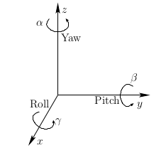
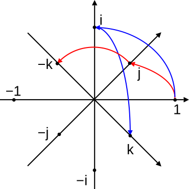

# Chapter 7 Geometry Transformation

- [Homogeneous Transformations](#homogeneous-transformations)
- [Translation, Scaling, and Rotations Matrices](#translation--scaling--and-rotations-matrices)
- [Euler Angles](#euler-angles)
- [Quaternions](#quaternions)
- [Orthogonal Vector Generation](#orthogonal-vector-generation)
- [Parametrized Lines And Hyperplanes](#parametrized-lines-and-hyperplanes)
- [Least Square Transformation Fitting](#least-square-transformation-fitting)

# Homogeneous Transformations

# Translation, Scaling, and Rotations Matrices

## Roll, Pitch and Yaw

 
 

 
 

 
 

 
 

Multiple transformation matrices exist, and they can be applied in various orders. 
The twelve rotation sequences can be divided into two categories: 
1. Proper Euler angles, where one axis of rotation is repeated (x-z-x, x-y-x, y-x-y, y-z-y, z-y-z, z-x-z), 
2. Tait-Bryan angles, which rotate around all axes (x-z-y, x-y-z, y-x-z, y-z-x, z-y-x, z-x-y).

 
 

It is important to note that  performs the roll first, then the pitch, and finally the yaw. 

 
 

## Determining yaw, pitch, and roll from a rotation matrix

 
 

 
 

 
 

and

 
 
There is a choice of four quadrants for the inverse tangent functions. Each quadrant should be chosen by using
the signs of the numerator and denominator of the argument. The <b>numerator</b> sign selects whether the direction will be above or below the <b> x-axis </b>, and the <b>denominator </b> selects whether the direction will be to the left or right of the <b>y-axis </b>. the function <b>atan2</b>
can calculate this for us:

- 

- 

- 

Note that this method assumes  and .

Now what if 

1. 
 
 

This will result in:

- 

- 

2. 

This will result in:

- 

- 

This means that there are infinitely many sets of (roll,yaw) angles for a given rotation matrix at with 

Visit the [link](https://compsci290-s2016.github.io/CoursePage/Materials/EulerAnglesViz/) for interactive Gimbal visualization.

## Euler Angles

## Quaternions

quaternion number system extends the complex numbers which introduced by William Rowan Hamilton. Hamilton defined a quaternion as the <b>quotient</b> of two vectors (two lines in a three-dimensional space). Quaternions are generally represented in the form:

where a, b, c, and d are real numbers; and i, j, and k are the basic quaternions ( symbols that can be interpreted as unit-vectors pointing along the three spatial axes).

a quaternion , as consisting of a scalar part and a vector part. 
The quaternion   is called the vector part (sometimes imaginary part) of q, and  is the scalar part (sometimes real part) of q.

### Basis
The set of quaternions is made a 4-dimensional vector space over the real numbers, with  as a basis, by the componentwise addition

 
 

 
 

### Hamilton product

For two elements  and , their product, called the Hamilton product and is determined by distributive law:

 
 

 
 

 
 

### Inverse with respect to the Hamilton product

 
 

### Conjugation 
### Norm
### Reciprocal

### The advantages of Quaternions 

- Avoiding gimbal lock, a problem with systems such as Euler angles.
- Faster and more compact than matrices.
- Nonsingular representation (compared with Euler angles for example).

Refs: [1](https://www.youtube.com/watch?v=d4EgbgTm0Bg),[2](https://www.youtube.com/watch?v=zjMuIxRvygQ), [3](https://quaternions.online/), [4](https://www.youtube.com/watch?v=zc8b2Jo7mno), [5](https://www.youtube.com/watch?v=syQnn_xuB8U),
[6](https://www.youtube.com/watch?v=4mXL751ko0w)

## Exponential Coordinates

# Orthogonal Vector Generation

# Parametrized Lines And Hyperplanes

# Least Square Transformation Fitting 

[<< Previous ](6_Sparse_Matrices.md)  [Home](README.md)   [Next >>](8_Differentiation.md)
